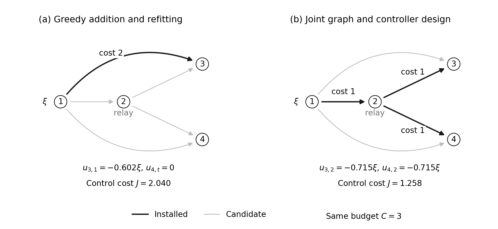
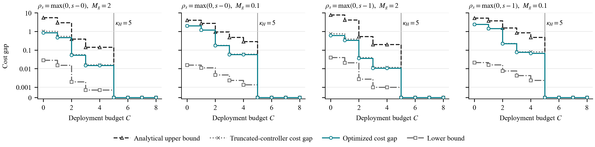
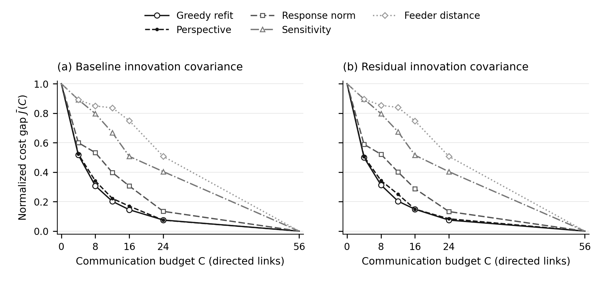
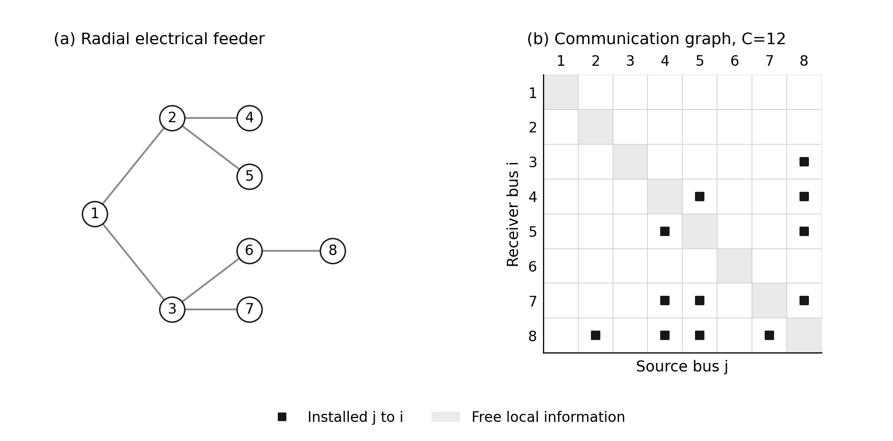
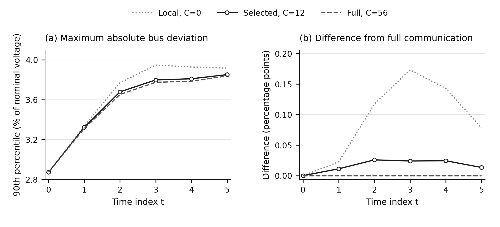

# System-Level Co-design of Predictive Controllers and Communication Graphs

Companion code for the manuscript

> Yifei WU, *System-Level Co-design of Predictive Controllers and Communication Graphs*, to be submitted to *SCIENCE CHINA Information Sciences*.

The code jointly synthesizes a finite-horizon system-level controller and a directed communication graph under a deployment budget. Paths in the selected graph determine when a local disturbance, and optionally its forecast, can reach each controller. An installed link is charged once even when several paths use it. Every optimization problem is solved centrally.

The repository reproduces the three experiments in the paper: a shared-route example, a predictive-control check of the performance bounds, and synthetic voltage studies with graph selection and objective certificates.

## Setup

Python 3.12.

```bash
python -m pip install -r requirements.txt
```

Do not run with `python -O`. Exact assertions are compiled out under `-O`.

## Reproduce

```bash
python check_response_algebra.py
python run_shared_link_example.py
python run_voltage_codesign.py
python run_voltage_codesign.py --verify-recorded-study --verify-envelope
python theorem.py
python plot.py
python build_control_figures.py
```

Results are written to `output/` and overwrite files of the same name. The images in `figures/` are snapshots from a completed run for this README.

Certificate rechecks of saved JSON need only the standard library:

```bash
python run_shared_link_example.py --verify
python verify_voltage_certificates.py
```

Optional and slower: `python run_voltage_codesign.py --regenerate-rankings` rebuilds the four ranking methods. `python run_voltage_codesign.py --regenerate-greedy` reruns 2136 greedy candidate solves.

Keep `output/archived_codesign_records.json` and `output/archived_voltage_envelope.json`. They are the original voltage baselines and are not regenerated by the default commands.

## Experiments

**SLS identities.** `check_response_algebra.py` checks the ordinary and forecast response equations, policy recovery in both directions, and causality masks in exact rational arithmetic.

**Shared-route example.** Four subsystems, five candidate links, budget 3. Graph objectives and stationary controllers are computed with `Fraction`. The example shows why greedy single-link addition can miss a shared route that serves two receivers.



*Shared-route example without predictions. Every link has unit delay. Relay links cost 1 and direct links cost 2. Greedy addition installs the direct link and stops. Joint design installs the shared route and obtains a lower control cost under the same budget $C=3$.*

**Performance bounds.** `theorem.py` enumerates 32 graphs on three nodes, with two forecast release times $q\in\{0,1\}$ and two response caps. For each budget it checks

```text
lower bound  <=  optimal cost gap  <=  truncated-controller gap  <=  upper bound
```

and records the budget $\kappa_H$ at which the full-graph mask is attained. This is floating-point validation, not an exact certificate. `q=0` releases the forecast at the target time. `q=1` releases it one sample earlier except at the initial time.



*Cost gap relative to the full-graph optimum. The optimized gap lies between the analytical lower bound and the truncated-controller upper bound. The gap vanishes at $\kappa_H=5$.*

**Voltage feeder.** Direct disturbance measurements and unit-delay links. The label `Forecast residual` is a prescribed innovation covariance, not an explicit prediction-response map. Default: 93 five-bus graphs and two eight-bus certificate trials, then independent rational certificates. No solver objective is trusted as a bound.



*Normalized voltage-control cost gap versus communication budget. The gap is $(J(C)-J_{\mathrm{full}})/(J_{\mathrm{local}}-J_{\mathrm{full}})$. Greedy refit and the perspective relaxation are compared with three ranking heuristics.*



*Eight-bus radial feeder and the communication graph selected by perspective refit at $C=12$ in the forecast-residual case. Matrix rows are receivers and columns are sources.*



*90th percentile of the largest absolute bus voltage deviation. Panel (b) subtracts the full-communication percentile from each curve. It is not the percentile of paired trajectory differences.*

## Layout

| Path | Role |
|---|---|
| `check_response_algebra.py` | Exact SLS identity checks |
| `run_shared_link_example.py` | Shared-route enumeration, greedy/exchange graphs, rational lower bounds |
| `run_voltage_codesign.py` | Voltage SLS certificates, ranking methods, archived-record checks |
| `verify_voltage_certificates.py` | Independent rational certificates |
| `theorem.py` | Enumeration of the predictive-control bound experiment |
| `plot.py` | Theorem figures from `output/theorem.json` |
| `write_tradeoff_data.py` | Normalized voltage cost table from verified records |
| `build_control_figures.py` | Paper figures written as PNG, SVG, and PDF |
| `output/archived_*.json` | Original voltage baselines. Do not delete |
| `figures/` | README snapshots. Regenerated plots go to `output/` |

## Information models

A disturbance response maps a local innovation into a later input. A prediction response maps an exogenous forecast into a later input. The forecast is not a future state measurement.

The voltage study uses disturbance responses only. The shared-route optional-prediction cases mix a residual controller with a lead-time forecast controller through a variance weight. The bound experiment parameterizes both maps jointly. Communication masks come from shortest-path delays and the release time $\rho_s=\max(0,s-q)$.

Local disturbances are assumed measured exactly. Relays are allowed. The bound instance has no voltage or inverter operating constraints.

## Citation

If you use this code, please cite the manuscript.

```bibtex
@article{wu2026codesign,
  author  = {Wu, Yifei},
  title   = {System-Level Co-design of Predictive Controllers and Communication Graphs},
  journal = {SCIENCE CHINA Information Sciences},
  note    = {Submitted},
  year    = {2026}
}
```
